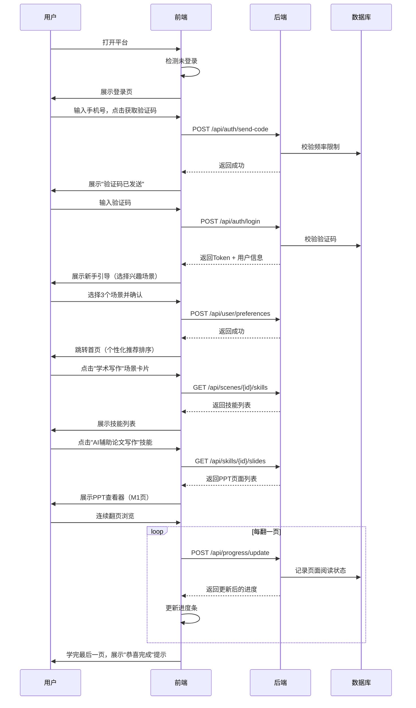
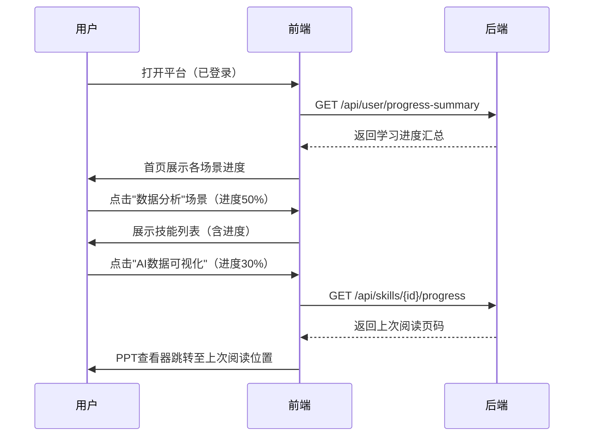
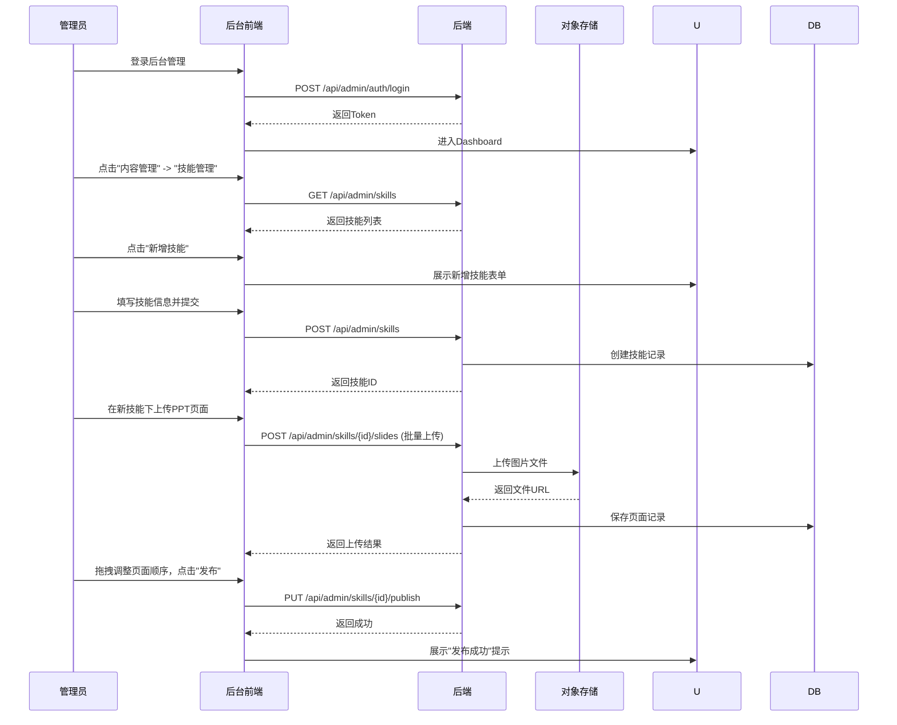
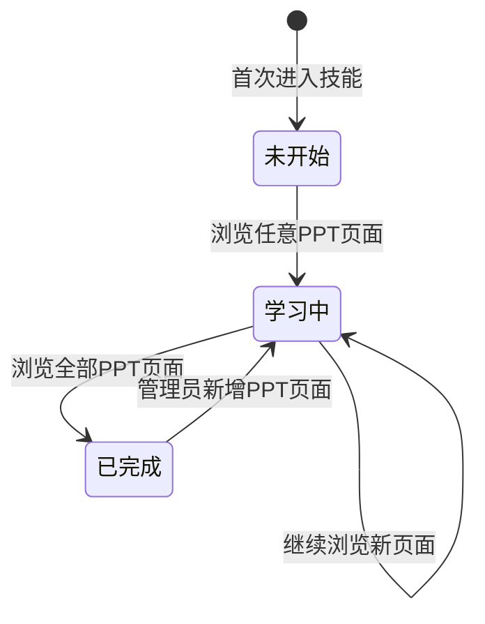
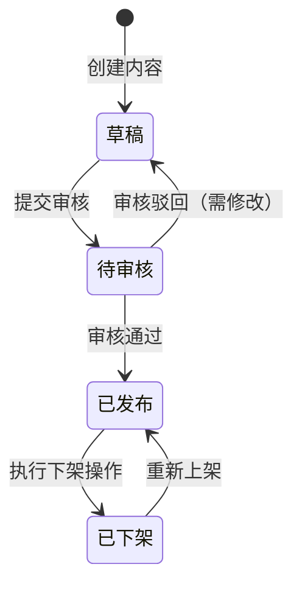

# AI赋能大学生技能PPT教程平台 产品需求文档

**文档编号**: PRD-V1.0  
**创建日期**: 2026-07-10  
**文档状态**: 草稿  
**产品分类**: 0-to-1 新产品 / AI教育产品  

---

## 目录

1. [产品概述](#1-产品概述)
2. [目标用户](#2-目标用户)
3. [功能需求](#3-功能需求)
4. [非功能需求](#4-非功能需求)
5. [用户角色与权限](#5-用户角色与权限)
6. [交互流程](#6-交互流程)
7. [界面设计要求](#7-界面设计要求)
8. [验收标准](#8-验收标准)
9. [数据与指标体系](#9-数据与指标体系)
10. [里程碑与路线图](#10-里程碑与路线图)

---

## 1. 产品概述

### 1.1 需求背景

当前高校教育体系中，AI工具的应用能力已成为大学生核心竞争力的关键组成部分。然而，绝大多数大学生面临以下困境：

- 知道AI工具存在，但不知道如何将其与具体学习场景结合；
- 缺乏系统化的AI技能学习路径，学习碎片化严重；
- 现有的AI教程多为通用型内容，缺乏针对大学生学业场景的定制化指导；
- 纯文字或视频教程的交互性不足，学习效果难以量化评估。

本平台旨在通过结构化的PPT教程体系，为大学生提供场景化、技能化的AI应用学习方案，覆盖10个核心学习场景下的18项关键技能，每项技能配套6模块标准化PPT教程，确保学习路径清晰、学习成果可衡量。

### 1.2 产品定位

面向大学生的AI技能学习平台，以"场景+技能+结构化PPT教程"为核心教学载体，帮助大学生在真实学业场景中熟练运用AI工具提升效率。

### 1.3 产品目标

| 目标维度 | 具体指标 | 目标值 | 衡量周期 |
|---------|---------|-------|---------|
| 用户规模 | 注册用户数 | 首月 5,000；首年 50,000（[假设——待确认]） | 月度 |
| 学习完成率 | 单技能教程完整学习率 | >= 60% | 周度 |
| 用户留存 | 次日留存 / 7日留存 / 30日留存 | 40% / 25% / 15% | 周度 |
| 内容覆盖 | 场景覆盖数 / 技能覆盖数 | 10 / 18 | 上线时一次性 |
| 用户满意度 | NPS净推荐值 | >= 30 | 月度 |

### 1.4 核心场景与技能体系

平台覆盖 **10个学习场景**，共计 **18项技能**，每项技能配套 **6模块标准化PPT教程**。

#### 10大学习场景

| 编号 | 场景名称 | 场景描述 | 覆盖技能数 |
|------|---------|---------|-----------|
| S01 | 学术写作 | 论文、报告、文献综述等学术文本的AI辅助创作 | 3 |
| S02 | 数据分析 | 实验数据、调研数据的AI辅助处理与可视化 | 2 |
| S03 | 编程开发 | 课程作业、项目开发中的AI辅助编码与调试 | 2 |
| S04 | 设计创作 | 海报、封面、插画等视觉内容的AI生成与编辑 | 2 |
| S05 | 演讲汇报 | 课堂展示、答辩汇报的AI辅助内容准备与演练 | 2 |
| S06 | 文献检索 | 学术文献的AI辅助检索、筛选与知识管理 | 2 |
| S07 | 项目管理 | 小组作业、社团活动的AI辅助规划与协作 | 1 |
| S08 | 语言学习 | 外语听说读写训练的AI辅助练习 | 1 |
| S09 | 考试备考 | 期末、考研、考证的AI辅助复习规划与模拟 | 1 |
| S10 | 职业规划 | 简历优化、面试模拟、行业调研的AI辅助 | 2 |

#### 18项技能清单

| 编号 | 所属场景 | 技能名称 | 技能描述 |
|------|---------|---------|---------|
| K01 | S01 学术写作 | AI辅助论文写作 | 利用AI工具完成论文大纲生成、段落扩写、润色降重 |
| K02 | S01 学术写作 | AI辅助文献综述 | 利用AI工具快速梳理文献脉络、生成综述框架 |
| K03 | S01 学术写作 | AI辅助实验报告 | 利用AI工具优化实验报告结构、数据处理与结论提炼 |
| K04 | S02 数据分析 | AI数据可视化 | 利用AI工具将原始数据转化为图表与可视化仪表盘 |
| K05 | S02 数据分析 | AI辅助统计分析 | 利用AI工具进行描述统计、假设检验与结果解读 |
| K06 | S03 编程开发 | AI辅助代码编写 | 利用AI编程助手完成课程作业代码生成与优化 |
| K07 | S03 编程开发 | AI辅助代码调试 | 利用AI工具定位Bug、解释报错信息、优化代码逻辑 |
| K08 | S04 设计创作 | AI图像生成 | 利用AI绘图工具生成海报、插画、Logo等视觉素材 |
| K09 | S04 设计创作 | AI视频剪辑 | 利用AI视频工具完成智能剪辑、字幕生成与转场 |
| K10 | S05 演讲汇报 | AI辅助PPT制作 | 利用AI工具一键生成PPT大纲、排版与配图 |
| K11 | S05 演讲汇报 | AI辅助演讲稿撰写 | 利用AI工具生成演讲稿、优化表达逻辑与感染力 |
| K12 | S06 文献检索 | AI辅助文献检索 | 利用AI学术搜索工具精准定位目标文献 |
| K13 | S06 文献检索 | AI辅助知识管理 | 利用AI笔记工具构建个人知识库与思维导图 |
| K14 | S07 项目管理 | AI辅助项目规划 | 利用AI工具制定项目计划、分配任务与跟踪进度 |
| K15 | S08 语言学习 | AI辅助外语学习 | 利用AI语言工具进行口语陪练、写作批改与翻译 |
| K16 | S09 考试备考 | AI辅助考试复习 | 利用AI工具生成复习计划、模拟试题与错题分析 |
| K17 | S10 职业规划 | AI辅助简历优化 | 利用AI工具分析岗位JD、优化简历内容与关键词匹配 |
| K18 | S10 职业规划 | AI辅助面试准备 | 利用AI工具进行模拟面试、常见问题训练与反馈 |

#### 6模块标准化PPT教程结构

每项技能的教学PPT均遵循以下6模块结构，确保学习体验一致、内容完整：

| 模块编号 | 模块名称 | 内容要点 | 建议页数 |
|---------|---------|---------|---------|
| M1 | 场景认知 | 该技能对应的真实学业场景、痛点分析、AI解决方案概述 | 5-8页 |
| M2 | 工具认知 | 推荐AI工具清单、工具对比、适用场景选择指南 | 6-10页 |
| M3 | 基础操作 | 分步操作演示、关键参数说明、常见错误规避 | 8-12页 |
| M4 | 进阶技巧 | 效率提升技巧、组合使用策略、高级功能挖掘 | 6-10页 |
| M5 | 实战案例 | 完整案例从头到尾演示、输入输出对比、效果评估 | 8-12页 |
| M6 | 总结复盘 | 核心知识点回顾、常见问题FAQ、延伸学习路径建议 | 4-6页 |

---

## 2. 目标用户

### 2.1 用户画像

#### 核心用户：在校大学生

| 属性 | 描述 |
|------|------|
| 年龄段 | 18-24岁 |
| 学历层次 | 本科在读（含大一至大四）、硕士研究生 |
| 专业分布 | 全专业覆盖，重点面向理工科、经管类、人文社科 |
| 技术基础 | 具备基本计算机操作能力，AI工具使用经验参差不齐（从零基础到有初步使用经验） |
| 核心痛点 | 知道AI有用但不知道如何用；试过AI但效果不佳；缺乏系统学习路径 |
| 使用场景 | 写论文、做PPT、写代码、备考复习、准备面试、做小组作业 |
| 使用频率 | 每周3-5次，每次15-45分钟（[假设——待确认]） |
| 设备偏好 | 笔记本电脑为主（80%），手机为辅（20%） |

#### 次要用户：高校教师/辅导员

| 属性 | 描述 |
|------|------|
| 核心需求 | 将平台内容作为教学辅助资源推荐给学生；了解学生AI技能掌握情况 |
| 使用频率 | 低频（每周1-2次，以浏览和推荐为主） |

#### 扩展用户：应届毕业生/职场新人

| 属性 | 描述 |
|------|------|
| 核心需求 | 快速补齐AI技能短板，提升求职竞争力 |
| 使用频率 | 高频短期集中使用 |

### 2.2 用户场景

| 优先级 | 场景描述 | 涉及技能 |
|--------|---------|---------|
| P0 | 大三学生小李正在撰写毕业论文，需要学习如何用AI辅助文献综述和论文写作 | K01, K02 |
| P0 | 大二学生小张要做课堂展示，需要快速学会用AI生成PPT和演讲稿 | K10, K11 |
| P1 | 计算机专业学生小王编程作业遇到Bug，需要学习AI辅助调试 | K06, K07 |
| P1 | 设计专业学生小陈需要为社团活动设计海报，想学习AI图像生成 | K08 |
| P2 | 大四学生小赵即将参加秋招，需要优化简历和模拟面试 | K17, K18 |
| P2 | 研一学生小刘需要高效管理文献，想学习AI辅助知识管理 | K12, K13 |

---

## 3. 功能需求

### 3.1 功能全景表

| 编号 | 模块 | 所属端 | 功能描述 | 优先级 |
|------|------|--------|---------|--------|
| F01 | 用户注册与登录 | 前台 | 支持手机号+验证码注册、邮箱注册、微信扫码登录；支持密码找回 | P0 |
| F02 | 场景浏览 | 前台 | 以卡片式布局展示10大学习场景，每个卡片展示场景名称、图标、覆盖技能数、学习进度 | P0 |
| F03 | 技能列表 | 前台 | 进入场景后展示该场景下全部技能，显示技能名称、难度标签、预计学习时长、完成状态 | P0 |
| F04 | PPT教程查看器 | 前台 | 在线查看6模块PPT教程，支持翻页、缩放、全屏、目录跳转、页码定位 | P0 |
| F05 | 学习进度追踪 | 前台 | 自动记录每页PPT的阅读状态，展示单技能/单场景/全局学习进度百分比 | P0 |
| F06 | 技能搜索 | 前台 | 支持按技能名称、场景名称、关键词进行全文搜索 | P1 |
| F07 | 个人学习中心 | 前台 | 展示学习统计（总学习时长、完成技能数、连续学习天数）、学习历史、收藏技能 | P1 |
| F08 | 技能收藏 | 前台 | 支持收藏感兴趣的技能，在个人中心快速访问 | P2 |
| F09 | 学习笔记 | 前台 | 在学习PPT过程中支持添加文字笔记，笔记与具体PPT页码关联 | P2 |
| F10 | 学习提醒 | 前台 | 支持设置每日学习提醒，推送学习内容推荐 | P2 |
| F11 | 内容管理 | 后台 | 场景/技能的增删改查；PPT页面的上传、排序、替换、预览 | P0 |
| F12 | 用户管理 | 后台 | 用户列表查看、搜索、禁用/启用；用户学习数据查看 | P0 |
| F13 | 数据统计 | 后台 | 核心指标Dashboard：注册用户数、活跃用户数、技能完成率、热门技能排行、用户留存率 | P1 |
| F14 | 内容审核 | 后台 | 对用户提交的笔记内容进行审核（敏感词过滤、违规内容处理） | P2 |
| F15 | 系统配置 | 后台 | 全局参数配置：首页推荐位、公告管理、功能开关 | P2 |

### 3.2 前台用户功能详述

#### F01 用户注册与登录

**业务逻辑**：
- 新用户通过手机号获取验证码完成注册，系统自动生成唯一用户ID并创建初始学习档案。
- 已注册用户通过手机号+验证码、手机号+密码或微信扫码任一方式登录。
- 登录成功后，系统返回JWT Token，前端存储并用于后续请求鉴权；Token有效期24小时，过期后自动刷新或要求重新登录。
- 首次注册用户进入新手引导流程：选择感兴趣的3个场景，系统据此生成个性化首页推荐。

**交互逻辑**：
- 用户打开应用，未登录状态下展示登录页，默认显示手机号登录Tab。
- 点击"微信登录"Tab切换至微信扫码登录界面，展示二维码。
- 输入手机号后点击"获取验证码"，按钮进入60秒倒计时，期间不可再次点击。
- 验证码输入完成后自动校验并登录，无需手动点击登录按钮。
- 登录失败时，页面顶部展示错误提示（验证码错误、账号不存在等），3秒后自动消失。

**规则约束**：
- 手机号：11位中国大陆手机号，格式校验正则 `^1[3-9]\d{9}$`。
- 验证码：6位数字，有效期5分钟，同一手机号每分钟最多发送1次，每日最多发送10次。
- 密码：8-20位，须包含字母和数字。
- 微信扫码：二维码有效期2分钟，过期后自动刷新。

**边界与异常**：
- 网络超时：请求超过10秒未响应，提示"网络异常，请稍后重试"并提供手动重试按钮。
- 验证码发送失败：提示"验证码发送失败，请稍后重试"。
- 账号被禁用：登录时提示"账号已被禁用，请联系管理员"。

#### F02 场景浏览

**业务逻辑**：
- 首页以网格布局展示10大学习场景卡片，卡片排列顺序支持后台配置（默认按场景编号排序）。
- 每张场景卡片展示：场景图标、场景名称、覆盖技能数、用户在该场景下的学习进度（环形进度条）。
- 已登录用户看到的进度为个人实际进度；未登录用户可浏览场景但进度不显示。
- 点击场景卡片进入该场景下的技能列表页。

**交互逻辑**：
- 页面加载时，场景卡片以渐入动画依次展示（每张间隔100ms）。
- 鼠标悬停卡片时，卡片轻微上浮并增加阴影深度。
- 点击卡片后，以页面左滑过渡动画进入技能列表页。

**边界与异常**：
- 场景数据加载失败：卡片区域展示骨架屏，3秒后若仍未加载成功，展示"加载失败，点击重试"提示。
- 空状态：若某场景下暂无技能，卡片上显示"即将上线"标签，不可点击。

#### F03 技能列表

**业务逻辑**：
- 进入场景后，以列表形式展示该场景下全部技能，按技能编号排序。
- 每项技能条目展示：技能名称、难度标签（入门/进阶/高级）、预计学习时长（如"约45分钟"）、完成状态标识（未开始/学习中/已完成）。
- 点击技能条目进入该技能的PPT教程查看器，默认从上次阅读位置继续。

**交互逻辑**：
- 页面顶部展示当前场景名称和返回首页的面包屑导航。
- 已完成技能条目的完成状态标识以绿色对勾展示。
- 学习中技能条目展示进度条（百分比）。

**边界与异常**：
- 技能列表为空：展示"该场景下暂无技能教程，敬请期待"空状态插画。
- 场景不存在：展示404提示页，提供返回首页按钮。

#### F04 PPT教程查看器

**业务逻辑**：
- 核心功能组件，用于在线查看6模块标准化PPT教程。
- 页面左侧展示6模块目录树，当前模块高亮，已完成模块以不同颜色标识。
- 页面中央为主视图区域，展示当前PPT页面内容。
- 页面底部展示页码指示器、翻页按钮、缩放控制、全屏按钮。
- 系统自动记录用户每页的阅读状态（已读/未读），翻页即标记为已读。
- 页面切换支持键盘左右方向键和鼠标滚轮。

**交互逻辑**：
- 点击左侧目录树中的模块名称，主视图跳转至该模块第一页。
- 点击翻页按钮或按键盘方向键，主视图以淡入淡出动画切换页面。
- 点击全屏按钮进入全屏模式，按ESC或点击退出全屏按钮退出。
- 缩放支持25%/50%/75%/100%/125%/150%/200%档位，默认100%。

**规则约束**：
- 每个PPT页面为一张图片（PNG/JPEG格式，建议分辨率1920x1080）。
- 单技能最多支持100页PPT。
- 支持的文件格式：PNG、JPEG、WebP。

**边界与异常**：
- 图片加载失败：展示占位图和"图片加载失败"提示，提供重试按钮。
- 网络中断：当前页已加载的图片不受影响，翻页时若网络中断则提示"网络连接异常，请检查网络后重试"。
- 页面不存在：若页码超出范围，翻页按钮置灰不可点击。

#### F05 学习进度追踪

**业务逻辑**：
- 系统以"已读页数 / 总页数"计算进度百分比，精确到整数。
- 进度在三个层级展示：单技能进度（6模块各自进度+总体进度）、单场景进度（该场景下所有技能的平均进度）、全局进度（所有场景的平均进度）。
- 进度数据实时更新，翻页操作后立即刷新进度显示。
- 进度数据存储在服务端，跨设备同步。

**交互逻辑**：
- 场景卡片上的环形进度条随进度变化，以动画形式平滑过渡。
- 技能列表条目上的进度条实时更新。
- 个人学习中心展示全局学习统计面板。

**边界与异常**：
- 技能总页数变更（如管理员新增PPT页面）：历史进度按旧页数记录，新页面标记为未读，进度百分比重新计算。

#### F06-F10 其他前台功能（简要）

- **F06 技能搜索**：页面顶部全局搜索框，输入关键词后实时展示匹配结果下拉列表，支持按场景过滤。搜索结果按相关度排序，高亮匹配文字。
- **F07 个人学习中心**：独立页面，包含学习统计卡片（总学习时长、完成技能数、连续学习天数、当前排名）、最近学习记录（最近5个学习的技能及进度）、收藏技能快捷入口。
- **F08 技能收藏**：技能详情页和列表页均有收藏按钮（星形图标），点击切换收藏状态。收藏数据同步至服务端。
- **F09 学习笔记**：PPT查看器右侧面板可展开笔记区域，点击"添加笔记"弹出输入框，笔记自动关联当前页码和技能ID。笔记支持编辑和删除。
- **F10 学习提醒**：用户可在个人中心设置每日提醒时间，系统通过微信服务通知或App推送发送学习提醒。

### 3.3 后台管理功能详述

#### F11 内容管理

**业务逻辑**：
- 管理员可对场景和技能进行完整的CRUD操作。
- 每个技能下可管理PPT页面：上传图片、拖拽排序、预览、替换、删除。
- 场景支持设置图标、名称、描述、排序权重。
- 技能支持设置名称、所属场景、难度标签、预计学习时长、排序权重、上下架状态。
- 内容变更后需手动点击"发布"使变更在前台生效（支持预览模式）。

**交互逻辑**：
- 场景管理页：表格展示所有场景，支持拖拽排序；点击编辑进入场景编辑弹窗。
- 技能管理页：左侧场景树形导航 + 右侧技能列表，点击技能展开PPT页面管理。
- PPT页面管理：网格缩略图展示所有页面，支持批量上传、拖拽排序、右键菜单操作（替换/删除/预览）。
- 上传图片时展示上传进度条，支持批量上传（最多同时上传20张）。

**规则约束**：
- 场景名称：2-20字符，不可重复。
- 技能名称：2-30字符，同一场景下不可重复。
- PPT图片：单张不超过5MB，建议分辨率1920x1080。
- 排序权重：整数，值越小越靠前。

**边界与异常**：
- 上传图片格式不支持：提示"仅支持PNG、JPEG、WebP格式"。
- 图片过大：提示"图片大小不能超过5MB，请压缩后重新上传"。
- 技能下无PPT页面：在前台展示"内容准备中"状态。

#### F12 用户管理

**业务逻辑**：
- 管理员可查看所有注册用户列表，支持按手机号、注册时间范围、用户状态筛选。
- 可查看单个用户详情：基本信息、注册时间、最后登录时间、学习统计（完成技能数、总学习时长、学习进度分布）。
- 支持禁用/启用用户账号，禁用后用户无法登录。

**交互逻辑**：
- 用户列表页：分页表格展示，支持搜索和筛选。
- 点击用户行进入用户详情页，展示学习数据Dashboard。
- 禁用操作触发二次确认弹窗。

**规则约束**：
- 用户列表默认按注册时间倒序排列。
- 每页展示20条用户记录。

#### F13-F15 其他后台功能（简要）

- **F13 数据统计**：Dashboard首页展示核心指标卡片（用户总数、日活、周活、月活、技能完成率），支持按时间范围筛选；热门技能Top10柱状图；用户留存率折线图；场景完成率对比图。
- **F14 内容审核**：用户笔记列表，支持按状态（待审核/已通过/已驳回）筛选；敏感词自动过滤标记；支持批量通过/驳回操作。
- **F15 系统配置**：首页推荐位配置（选择推荐场景或技能）；公告管理（新增/编辑/删除公告，前台以跑马灯或弹窗展示）；功能开关（控制新功能的灰度发布）。

---

## 4. 非功能需求

### 4.1 性能要求

| 指标 | 要求 | 测量方法 |
|------|------|---------|
| 页面首屏加载时间 | <= 2秒（4G网络环境） | Lighthouse Performance Score >= 80 |
| PPT图片加载时间 | 单张图片 <= 1秒 | CDN日志分析 |
| 接口响应时间 | P95 <= 500ms，P99 <= 1000ms | APM监控 |
| 并发用户数 | 支持同时在线 2,000 用户 | 压力测试 |
| 搜索响应时间 | <= 300ms | 接口监控 |
| 图片上传处理时间 | <= 3秒/张 | 后台上传日志 |

### 4.2 安全要求

- 所有API请求使用HTTPS协议传输。
- 用户密码使用bcrypt加盐哈希存储，不可逆加密。
- 验证码接口增加频率限制：同一IP每分钟最多请求5次，同一手机号每分钟最多请求1次。
- JWT Token设置合理过期时间（24小时），支持Refresh Token机制。
- 后台管理接口强制鉴权，管理员操作记录审计日志（操作人、操作时间、操作类型、操作对象、操作结果）。
- 用户上传的PPT图片和笔记内容需经过内容安全扫描（敏感词过滤、图片审核）。
- 防止常见Web攻击：XSS（输入转义+输出编码）、CSRF（Token校验）、SQL注入（参数化查询）。
- 敏感数据（手机号）在日志和数据库中脱敏存储。

### 4.3 可用性要求

- 系统可用性目标：99.5%（月度）。
- 核心服务（用户登录、PPT查看）部署多实例，单实例故障自动切换。
- 数据库主从架构，故障自动切换时间 <= 30秒。
- 定时数据备份：每日全量备份，保留最近30天。
- 服务降级策略：当图片服务不可用时，展示缓存版本或占位图；当搜索服务不可用时，降级为前端本地过滤。

### 4.4 可扩展性要求

- 前后端分离架构，前端与后端通过RESTful API通信，便于后续开发移动端。
- 场景和技能数据结构设计为灵活扩展模式，新增场景和技能无需修改数据库Schema。
- PPT模块结构参数化，支持未来调整模块数量（如从6模块扩展至8模块）。
- 图片存储使用对象存储服务（如阿里云OSS、腾讯云COS），支持CDN加速，便于横向扩展。
- 支持水平扩展：无状态应用服务可随负载增加实例数量。

### 4.5 兼容性要求

- 浏览器兼容：Chrome 90+、Edge 90+、Safari 14+、Firefox 88+。
- 屏幕分辨率适配：最小支持1366x768，推荐1920x1080及以上。
- 移动端适配：PPT查看器支持响应式布局，在移动端提供基本浏览能力（翻页、缩放）。

---

## 5. 用户角色与权限

### 5.1 角色定义

| 角色 | 角色标识 | 描述 |
|------|---------|------|
| 游客 | guest | 未登录用户，可浏览场景和技能列表，不可查看PPT教程详细内容 |
| 普通用户 | user | 已注册登录用户，可查看全部PPT教程、记录学习进度、使用全部前台功能 |
| 内容管理员 | content_admin | 负责场景、技能、PPT内容的管理和维护 |
| 用户管理员 | user_admin | 负责用户管理、数据查看 |
| 超级管理员 | super_admin | 拥有全部权限，包括系统配置、角色分配 |

### 5.2 权限矩阵

| 功能模块 | 功能点 | 游客 | 普通用户 | 内容管理员 | 用户管理员 | 超级管理员 |
|---------|--------|------|---------|-----------|-----------|-----------|
| 场景浏览 | 查看场景列表 | Y | Y | Y | Y | Y |
| 技能浏览 | 查看技能列表 | Y | Y | Y | Y | Y |
| PPT查看 | 查看PPT教程 | N | Y | Y | Y | Y |
| 学习进度 | 记录/查看进度 | N | Y | Y | Y | Y |
| 技能搜索 | 搜索技能 | Y | Y | Y | Y | Y |
| 技能收藏 | 收藏/取消收藏 | N | Y | Y | Y | Y |
| 学习笔记 | 添加/编辑/删除笔记 | N | Y | Y | Y | Y |
| 学习提醒 | 设置提醒 | N | Y | Y | Y | Y |
| 内容管理 | 场景/技能/PPT管理 | N | N | Y | N | Y |
| 用户管理 | 用户列表/详情 | N | N | N | Y | Y |
| 用户管理 | 禁用/启用用户 | N | N | N | Y | Y |
| 数据统计 | 查看统计Dashboard | N | N | Y | Y | Y |
| 内容审核 | 审核笔记 | N | N | Y | N | Y |
| 系统配置 | 全局配置管理 | N | N | N | N | Y |
| 角色管理 | 分配管理员角色 | N | N | N | N | Y |

---

## 6. 交互流程

### 6.1 核心用户路径

#### 路径一：首次学习完整流程



#### 路径二：继续学习流程



#### 路径三：后台内容管理流程



### 6.2 状态流转

#### 用户学习状态流转



#### 内容发布状态流转



---

## 7. 界面设计要求

### 7.1 设计原则

- **简洁专业**：界面布局清爽，减少视觉噪音，突出内容本身。避免过多装饰元素，以留白和间距构建呼吸感。
- **内容优先**：PPT教程是核心载体，查看器设计应最大化内容展示区域，控件在非操作时自动隐藏。
- **学习沉浸感**：色彩运用克制，避免使用高饱和度色彩干扰注意力，以中性色为主色调，品牌色作为点缀。
- **一致性**：所有页面遵循统一的设计语言，组件复用，交互模式统一。

### 7.2 配色方案（武汉理工大学蓝黄配色）

#### 主色调

| 色彩角色 | 色值 | 色样 | 使用场景 |
|---------|------|------|---------|
| 品牌蓝（主色） | `#003D7A` | 深蓝 | 顶部导航栏、主按钮、重要标题、图标 |
| 品牌蓝（辅助） | `#005BAC` | 中蓝 | 链接文字、选中状态、进度条 |
| 品牌蓝（浅色） | `#E8F0FE` | 浅蓝 | 卡片悬停背景、选中行背景 |
| 品牌黄（点缀） | `#FFC72C` | 金黄 | 高亮标签、重要提示、CTA按钮、完成状态标识 |
| 品牌黄（浅色） | `#FFF8E1` | 浅黄 | 提示信息背景、高亮标注 |

#### 中性色

| 色彩角色 | 色值 | 使用场景 |
|---------|------|---------|
| 文字主色 | `#1A1A1A` | 正文、标题 |
| 文字辅色 | `#666666` | 辅助说明、时间戳 |
| 文字禁用 | `#BFBFBF` | 禁用状态文字、占位符 |
| 背景主色 | `#FFFFFF` | 页面主背景 |
| 背景辅色 | `#F5F7FA` | 卡片背景、侧边栏背景 |
| 分割线 | `#E8E8E8` | 列表分割、卡片边框 |
| 阴影 | `rgba(0,0,0,0.06)` | 卡片投影 |

#### 功能色

| 色彩角色 | 色值 | 使用场景 |
|---------|------|---------|
| 成功绿 | `#52C41A` | 完成状态、成功提示 |
| 警告橙 | `#FAAD14` | 警告提示 |
| 错误红 | `#FF4D4F` | 错误提示、删除操作 |
| 信息蓝 | `#1890FF` | 信息提示 |

### 7.3 布局规范

- **首页**：顶部导航栏（Logo + 搜索框 + 用户头像）+ 主内容区（场景卡片网格 3列/行）+ 底部信息栏。
- **技能列表页**：顶部面包屑导航 + 左侧场景侧边栏 + 右侧技能列表（卡片式）。
- **PPT查看器**：顶部工具栏（自动隐藏）+ 左侧模块目录（可折叠）+ 中央主视图 + 底部控制栏（页码、翻页、缩放、全屏）。
- **后台管理**：左侧固定导航菜单（240px宽）+ 右侧内容区。

### 7.4 关键页面线框描述

#### 首页布局

```
+------------------------------------------------------------------+
|  Logo    [搜索框________________]           [头像] [用户名]       |  <- 导航栏 (#003D7A)
+------------------------------------------------------------------+
|                                                                    |
|  [欢迎语] 继续学习上次的进度...                                     |
|                                                                    |
|  +------------------+  +------------------+  +------------------+  |
|  | [场景图标]       |  | [场景图标]       |  | [场景图标]       |  |
|  | 学术写作         |  | 数据分析         |  | 编程开发         |  |
|  | 3个技能 · 进度30%|  | 2个技能 · 进度0% |  | 2个技能 · 进度60%|  |
|  | [====进度条====] |  | [进度条]         |  | [======进度条===]|  |
|  +------------------+  +------------------+  +------------------+  |
|                                                                    |
|  +------------------+  +------------------+  +------------------+  |
|  | ...              |  | ...              |  | ...              |  |
|  +------------------+  +------------------+  +------------------+  |
|                                                                    |
+------------------------------------------------------------------+
|  关于我们  |  帮助中心  |  用户协议  |  隐私政策                    |  <- 底部
+------------------------------------------------------------------+
```

#### PPT查看器布局

```
+------------------------------------------------------------------+
|  [< 返回]  AI辅助论文写作 - M3 基础操作            [全屏] [关闭] |  <- 工具栏
+----------+-------------------------------------------------------+
|          |                                                        |
|  [M1]    |                                                        |
|  场景认知 |                   PPT主视图区域                        |
|          |                                                        |
|  [M2]    |             (当前展示PPT页面图片)                       |
|  工具认知 |                                                        |
|          |                                                        |
| >[M3]    |                                                        |
|  基础操作 |                                                        |
|   - 页3  |                                                        |
|          |                                                        |
|  [M4]    |                                                        |
|  进阶技巧 |                                                        |
|          |                                                        |
|  [M5]    |                                                        |
|  实战案例 |                                                        |
|          |                                                        |
|  [M6]    |                                                        |
|  总结复盘 |                                                        |
|          |                                                        |
+----------+-------------------------------------------------------+
|  [< 上一页]   3 / 45   [下一页 >]    [50%] [100%] [150%] [全屏]  |  <- 底部控制栏
+------------------------------------------------------------------+
```

### 7.5 字体与排版

- **中文字体**：系统默认字体栈（-apple-system, "PingFang SC", "Microsoft YaHei", sans-serif）。
- **英文字体**：-apple-system, "Segoe UI", "Helvetica Neue", sans-serif。
- **标题层级**：H1 28px/700, H2 22px/600, H3 18px/600, H4 16px/500。
- **正文**：14px/400, 行高1.6。
- **辅助文字**：12px/400, 行高1.5。
- **间距体系**：基础间距单位 8px，常用间距 8px / 16px / 24px / 32px / 48px。

---

## 8. 验收标准

### 8.1 前台用户功能验收

| 验收项编号 | 验收内容 | 验收条件 | 验收方法 |
|-----------|---------|---------|---------|
| AC-F01 | 用户注册 | 手机号注册成功，收到验证码短信，注册后自动登录并进入新手引导 | 手动测试 |
| AC-F02 | 用户登录 | 手机号+验证码、手机号+密码、微信扫码三种方式均可正常登录 | 手动测试 |
| AC-F03 | 场景浏览 | 首页正确展示10个场景卡片，卡片信息（名称、技能数、进度）准确 | 手动测试 + 数据校验 |
| AC-F04 | 技能列表 | 进入场景后正确展示该场景下全部技能，列表中各字段正确 | 手动测试 + 数据校验 |
| AC-F05 | PPT查看器 | 翻页、缩放、全屏、目录跳转、页码定位功能正常；图片加载速度 <= 1秒 | 手动测试 + 性能测试 |
| AC-F06 | 学习进度 | 翻页后进度实时更新；退出重新进入后从上次位置继续；进度百分比计算准确 | 手动测试 + 数据校验 |
| AC-F07 | 技能搜索 | 输入关键词能正确匹配技能名称和场景名称；搜索结果按相关度排序 | 手动测试 |
| AC-F08 | 个人中心 | 学习统计数据准确（总时长、完成数、连续天数）；学习历史记录完整 | 手动测试 + 数据校验 |
| AC-F09 | 技能收藏 | 收藏/取消收藏操作即时生效，状态正确同步 | 手动测试 |
| AC-F10 | 学习笔记 | 笔记可添加、编辑、删除；笔记与PPT页码关联正确；刷新后数据不丢失 | 手动测试 |
| AC-F11 | 响应式适配 | 在1366x768和1920x1080分辨率下页面布局正常，无元素重叠或溢出 | 手动测试 |

### 8.2 后台管理功能验收

| 验收项编号 | 验收内容 | 验收条件 | 验收方法 |
|-----------|---------|---------|---------|
| AC-B01 | 场景管理 | 场景的增删改查操作正常；排序调整后前台展示顺序同步更新 | 手动测试 |
| AC-B02 | 技能管理 | 技能的增删改查操作正常；上下架状态切换后前台即时生效 | 手动测试 |
| AC-B03 | PPT上传 | 支持批量上传图片；上传进度展示准确；上传后图片可正常预览 | 手动测试 |
| AC-B04 | PPT排序 | 拖拽排序功能正常；排序后前台PPT展示顺序同步更新 | 手动测试 |
| AC-B05 | 内容发布 | 内容变更后需手动发布才在前台生效；预览模式可查看未发布内容 | 手动测试 |
| AC-B06 | 用户管理 | 用户列表正确展示；搜索和筛选功能正常；禁用/启用操作生效 | 手动测试 |
| AC-B07 | 数据统计 | Dashboard各指标卡片数据准确；图表展示正确；时间范围筛选生效 | 手动测试 + 数据校验 |
| AC-B08 | 权限控制 | 非管理员账号无法访问后台页面；不同管理员角色权限隔离正确 | 手动测试 |

### 8.3 非功能需求验收

| 验收项编号 | 验收内容 | 验收条件 | 验收方法 |
|-----------|---------|---------|---------|
| AC-NF01 | 首屏加载 | 4G网络下首屏加载时间 <= 2秒 | Lighthouse测试 |
| AC-NF02 | 接口性能 | P95接口响应时间 <= 500ms | 压力测试 + APM监控 |
| AC-NF03 | 并发能力 | 2,000并发用户下系统正常运行，无超时或错误 | JMeter压力测试 |
| AC-NF04 | 安全性 | 通过OWASP Top 10安全扫描，无高危漏洞 | 安全扫描工具 |
| AC-NF05 | 浏览器兼容 | Chrome 90+、Edge 90+、Safari 14+、Firefox 88+下功能正常 | 手动测试 |
| AC-NF06 | 可用性 | 月度可用性 >= 99.5% | 监控系统统计 |

### 8.4 内容验收

| 验收项编号 | 验收内容 | 验收条件 | 验收方法 |
|-----------|---------|---------|---------|
| AC-C01 | 场景覆盖 | 10个场景全部上线，每个场景至少包含1项技能 | 内容审核 |
| AC-C02 | 技能覆盖 | 18项技能全部上线，每项技能包含完整的6模块PPT | 内容审核 |
| AC-C03 | PPT质量 | 每项技能PPT页数符合模块规范（M1 5-8页, M2 6-10页, M3 8-12页, M4 6-10页, M5 8-12页, M6 4-6页） | 内容审核 |
| AC-C04 | PPT可读性 | 所有PPT图片分辨率不低于1920x1080，文字清晰可读 | 内容审核 |

---

## 9. 数据与指标体系

### 9.1 核心指标

| 指标类别 | 指标名称 | 定义 | 目标值 | 监控频率 |
|---------|---------|------|-------|---------|
| 规模 | 注册用户数 | 累计注册用户总数 | 首月5,000 | 日 |
| 规模 | DAU | 每日活跃用户数（当日至少浏览1页PPT） | 首月500 | 日 |
| 活跃 | 次日留存率 | 注册次日回访用户占比 | >= 40% | 日 |
| 活跃 | 7日留存率 | 注册7日内回访用户占比 | >= 25% | 日 |
| 活跃 | 30日留存率 | 注册30日内回访用户占比 | >= 15% | 周 |
| 转化 | 新手引导完成率 | 完成兴趣选择并进入首页的注册用户占比 | >= 80% | 日 |
| 转化 | 首次技能打开率 | 注册后24小时内打开任意技能的用户占比 | >= 60% | 日 |
| 转化 | 首个技能完成率 | 完成任意1项技能全部PPT的用户占比 | >= 30% | 周 |
| 学习 | 人均学习时长 | 用户每日平均学习时长（分钟） | >= 15分钟 | 日 |
| 学习 | 人均学习页数 | 用户每日平均浏览PPT页数 | >= 20页 | 日 |
| 学习 | 技能完成率 | 已完成技能数 / 总技能数 | >= 20% | 周 |
| 质量 | NPS | 净推荐值 | >= 30 | 月 |
| 质量 | 技能评分 | 用户对技能教程的评分（1-5星） | >= 4.0 | 月 |

### 9.2 埋点需求

| 事件名称 | 触发时机 | 必传属性 | 选传属性 |
|---------|---------|---------|---------|
| page_view | 页面浏览 | page_name, user_id, timestamp | referrer, device_type |
| scene_click | 点击场景卡片 | scene_id, scene_name, user_id | progress_before |
| skill_click | 点击技能条目 | skill_id, skill_name, scene_id, user_id | progress_before |
| slide_view | 查看PPT页面 | skill_id, slide_page, module_id, user_id | view_duration |
| slide_navigate | 翻页操作 | skill_id, from_page, to_page, direction, user_id | - |
| skill_complete | 完成技能全部PPT | skill_id, skill_name, total_duration, user_id | - |
| search_query | 执行搜索 | query_text, result_count, user_id | - |
| search_click | 点击搜索结果 | query_text, clicked_skill_id, position, user_id | - |
| favorite_toggle | 收藏/取消收藏 | skill_id, action(add/remove), user_id | - |
| note_add | 添加笔记 | skill_id, slide_page, user_id | - |
| user_register | 注册成功 | user_id, register_method, timestamp | - |
| user_login | 登录成功 | user_id, login_method, timestamp | - |

---

## 10. 里程碑与路线图

### 10.1 里程碑规划

| 阶段 | 里程碑 | 时间节点 | 交付物 | 负责人 |
|------|--------|---------|--------|--------|
| M1 | 需求评审完成 | 第1周 | 确认PRD，完成需求评审 | 产品经理 [待确认] |
| M2 | 设计评审完成 | 第2周 | UI设计稿定稿，交互原型确认 | 设计师 [待确认] |
| M3 | 技术方案评审 | 第3周 | 技术架构设计文档、数据库设计文档 | 技术负责人 [待确认] |
| M4 | MVP开发完成 | 第6周 | 前台核心功能（F01-F05）+ 后台内容管理（F11） | 开发团队 [待确认] |
| M5 | MVP测试完成 | 第7周 | 测试报告，Bug清零 | QA [待确认] |
| M6 | MVP上线 | 第8周 | 首批4个场景、8项技能上线 | 全员 [待确认] |
| M7 | 全量内容上线 | 第12周 | 10个场景、18项技能全部上线 | 内容团队 [待确认] |
| M8 | 功能迭代V1.1 | 第16周 | 搜索、收藏、笔记、提醒功能上线 | 开发团队 [待确认] |
| M9 | 正式版发布 | 第20周 | 全功能GA版本发布 | 全员 [待确认] |

### 10.2 MVP范围

MVP阶段（第8周上线）聚焦核心闭环：

- **前台**：用户注册登录(F01)、场景浏览(F02)、技能列表(F03)、PPT查看器(F04)、学习进度追踪(F05)
- **后台**：内容管理(F11)、用户管理(F12)
- **内容**：首批上线4个场景（学术写作、数据分析、编程开发、演讲汇报），覆盖8项技能
- **不包含**：搜索、收藏、笔记、学习提醒、数据统计Dashboard、内容审核、系统配置

---

## 附录

### A. 术语表

| 术语 | 定义 |
|------|------|
| 场景 | 大学生学习生活中的具体应用领域，如学术写作、数据分析等 |
| 技能 | 场景下的具体AI应用能力，如"AI辅助论文写作" |
| 模块 | 每项技能PPT教程的6个教学单元，分别为场景认知、工具认知、基础操作、进阶技巧、实战案例、总结复盘 |
| PPT教程 | 以图片形式展示的结构化教学PPT，每页为一张图片 |

### B. 假设与待确认事项

以下内容为基于合理推断的内容，需在后续评审中确认：

- 用户规模目标（首月5,000、首年50,000）为初步假设，需结合市场调研和推广资源确认。
- 使用频率（每周3-5次）为用户调研假设，需通过MVP阶段数据验证。
- 10个场景和18项技能的具体内容需与教学专家团队评审确认。
- 里程碑时间节点和负责人为初步规划，需根据团队资源和实际情况调整。

---

*文档结束*